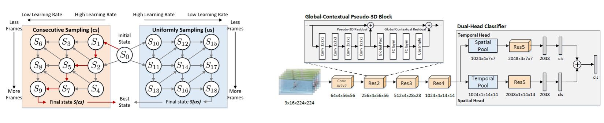

Optimization-Planning-for-3D-ConvNets
====

#### Code for the ICML 2021 paper: [Optimization Planning for 3D ConvNets](https://proceedings.mlr.press/v139/qiu21c.html).

##### Authors: [Zhaofan Qiu](http://zhaofanqiu.deepfun.club/), Ting Yao, Chong-Wah Ngo, Tao Mei




### 1. Requirement
The provided codes have been tested with Python-3.9.5 & Pytorch-1.9.0 on four Tesla-V100s.

### 2. Project structure

```bash
├─ base_config             # Pre-set config file for each dataset
├─ dataset                 # Video lists (NOT provided) and code to load video data
├─ jpgs                    # Images for README
├─ layers                  # Custom network layers
├─ model                   # Network architectures
├─ record                  # Config file for each run
├─ utils                   # Basic functions
├─ extract_score_3d.py     # Main script to extract predicted score
├─ helpers.py              # Helper functions for main scripts
├─ merge_score.py          # Main script to merge scores from different clips
├─ train_3d.py             # Main script to launch a training using given strategy
├─ train_3d_op.py          # Main script to launch a searching of best strategy
└─ run.sh                  # Shell script for training-extracting-merging pipeline
```

### 3. Run the code
1. Pre-process the target dataset and put the lists in to the `dataset` folder. Codes in dataset/video_dataset.py can load three video formats (raw video, jpeg frames and video LMDB) and can be simply modified to support the custom format.
2. Make config file in the `record` folder. The config examples include `op-*.yml` for pre-searched strategy, `kinetics-*.yml` for simple strategy on Kinetics-400, 
3. Run run.sh for the training-extracting-merging pipeline or replace train_3d.py with train_3d_op.py for searching the optimal strategy.

### 4. TO DO
Add more explainations and examples.

### 5. Contact
Please feel free to email to [Zhaofan Qiu](zhaofanqiu@gmail.com) if you have any question regarding the paper or any suggestions for further improvements. 

### 6. Citation
If you find this code helpful, thanks for citing our work as
```
@inproceedings{qiu2021optimization,
title={Optimization Planning for 3D ConvNets},
author={Qiu, Zhaofan and Yao, Ting and Ngo, Chong-Wah and Mei, Tao},
booktitle={Proceedings of the 38th International Conference on Machine Learning (ICML)},
publisher={PMLR},
year={2021}
}
```
Please also pay attention to the citations of the included networks/algorithms.
